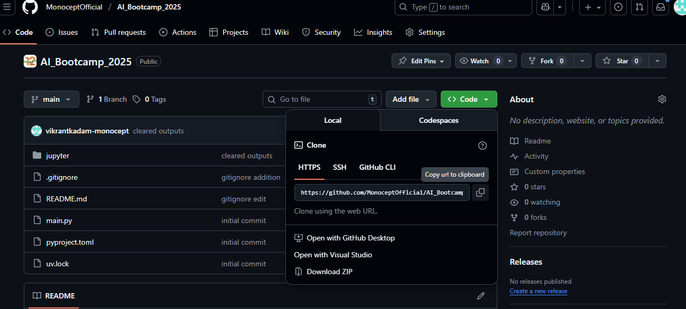
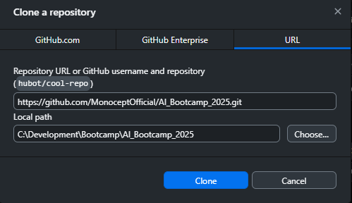
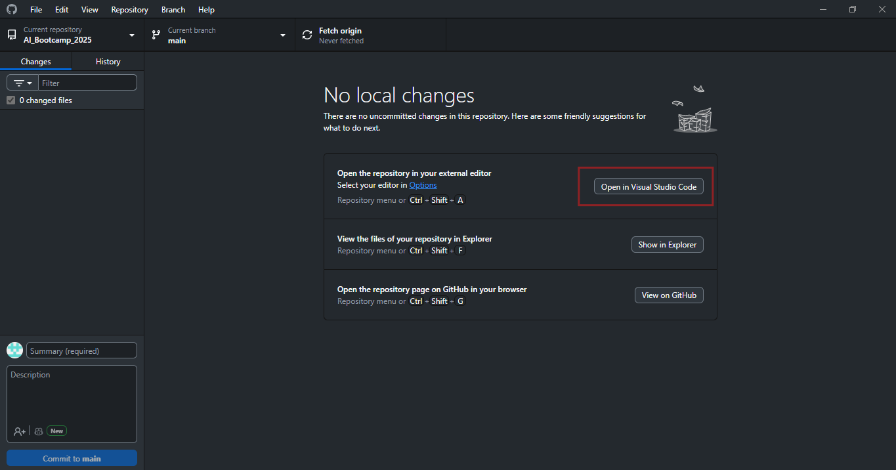
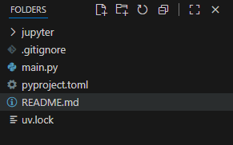
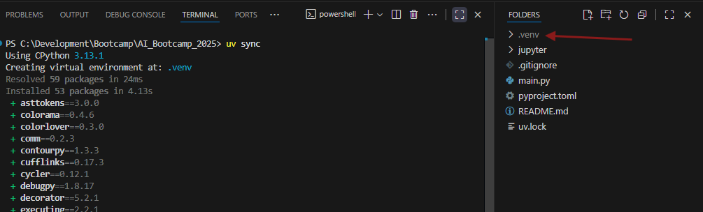
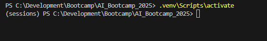

# AI_Bootcamp_2025

## Steps to Run Jupyter Notebooks

1. **Clone the Repository**

   

   a. Download and install **GitHub Desktop** to operate Git through a user interface (UI).
   

   b. Download **Visual Studio Code (VS Code)** and open the cloned repository in it.
   

2. **Install UV**

   a. Install the **UV package manager** using the following command:

   ```powershell
   powershell -ExecutionPolicy ByPass -c "irm https://astral.sh/uv/install.ps1 | iex"
   ```

   b. Follow the on-screen instructions to add `uv` to your environment path.
   Example:

   ```powershell
   $env:Path = "C:\Users\USERNAME\.local\bin;$env:Path"
   ```

   c. If steps (a) and (b) do not work, try running the following command in the VS Code PowerShell terminal and then attempt the installation again:

   ```powershell
   Set-ExecutionPolicy -Scope Process -ExecutionPolicy Bypass
   ```

3. **Activate the Virtual Environment**

   a. Your project structure should look like this:
   

   b. Run the following command to install all required libraries for the project. This will create a `.venv` folder in your project directory where all dependencies will be stored.

   ```bash
   uv sync
   ```

   

   c. Activate the virtual environment by running:

   ```bash
   .venv\Scripts\activate
   ```

   Once activated, the name of your virtual environment should appear in parentheses at the start of your terminal prompt.
   

4. **Run Jupyter**

   a. Launch Jupyter Lab using the following command:

   ```bash
   uv run --with jupyter jupyter lab
   ```

---
